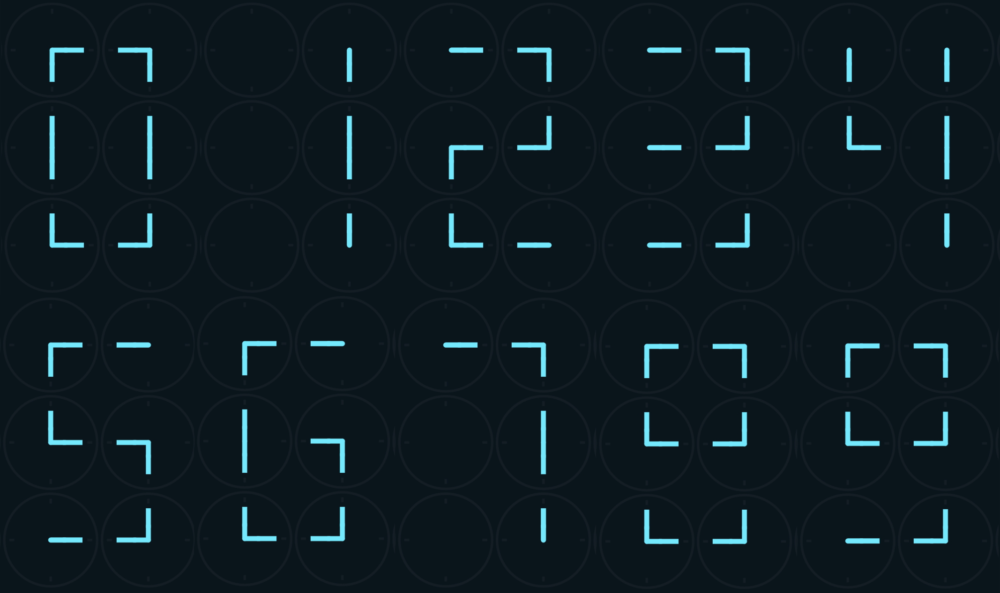
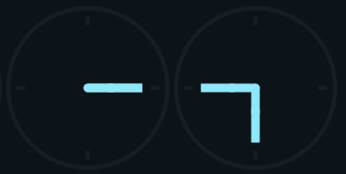

# Nomeyho clock
> A digital clock made of analog clocks.
Submitted for the [https://flutter.dev/clock](Flutter Clock Challenge).

[VIDEO HERE]

## Presentation
The Nomeyho clock is a digital clock that displays the current date and time.
It combines digital and analog clocks in a unique way.

### Digits
Each digit of the Nomeyho clock is constructed using six analog clocks, laid out in a 2-by-3 grid.
The segments composing each digit are made-up of the analog clock hands.

Each digit from 0 to 9 can be represented by analog clocks set to the appropriate time.

### Animation
The transition between the digit makes the Nomeyho clock special. One or more digit change every minute.
The individual analog clocks have to display a new time and the hands simultaneously rotates clockwise to
reach their new position. The unused hands will fade out to improve the readability of the overall digit.

### Details
A particular attention was given to the following details:
* Clock hand ends: the clock hands are only rounded on one end. It ensures the continuity of
the segments and gives *smooth* edges to the digits.

* Readability: a different color was used for the hour digits and for the minutes digits.
The colors create a clear separation between the two group of digits and makes the reading easier.

### Theme
A light theme is also available:

## Intl
The current date can be displayed in multiple languages thanks to
the [https://pub.dev/packages/intl](intl) package. Both 12-hour format and 24-hour format are supported.

## Credits
* [https://clockclock.com/](ClockClock 24) for the inspiration
* [https://fonts.google.com/specimen/Barlow](https://fonts.google.com/specimen/Barlow) for the font
* The Flutter team for the awesome framework
