# Nomeyho clock

Submitted for the [Flutter Clock Challenge](https://flutter.dev/clock).

[VIDEO HERE]

## Presentation
The Nomeyho clock is a clock face UI for the [Lenovo Smart Clock](https://www.lenovo.com/fr/fr/smart-clock/).
It displays the current date and time in a unique way by combining digital and analog clocks.

    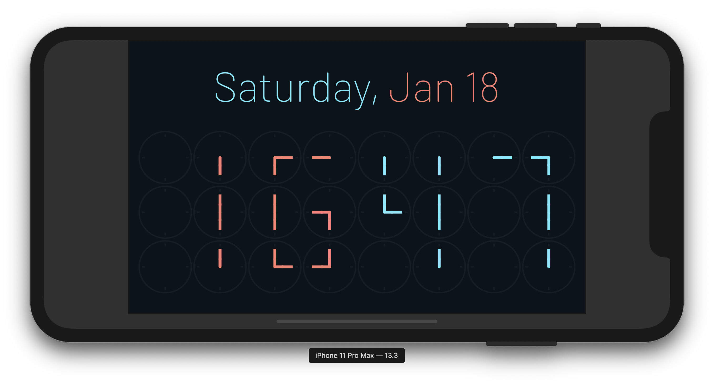

### Digits
The Nomeyho clock is a digital clock made of 24 analog clocks.
Each digit consists of six analog clocks, laid out on a 2-by-3 grid.

    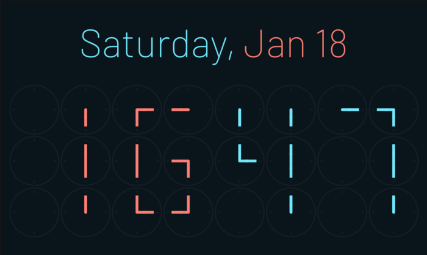

The segments composing each digit are made of the analog clock hands. The digits from 0 to 9
can be represented provided that the analog clocks are set to the appropriate time.

    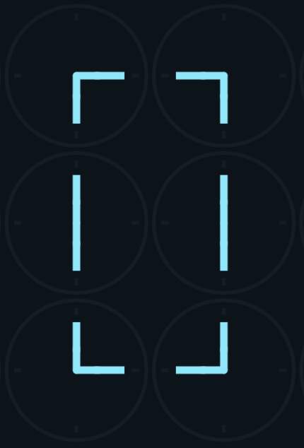
    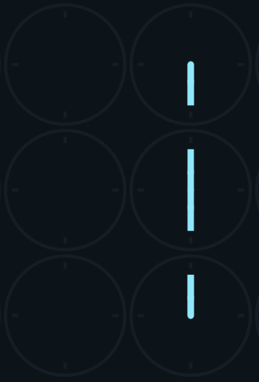
    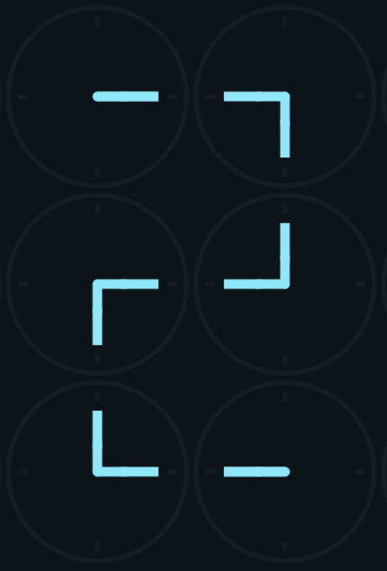
    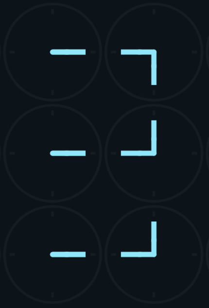
    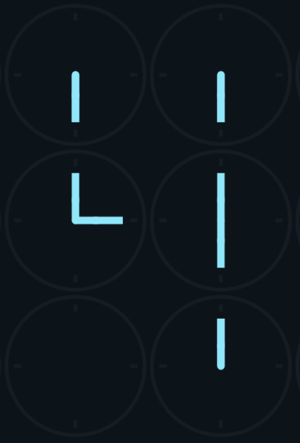

    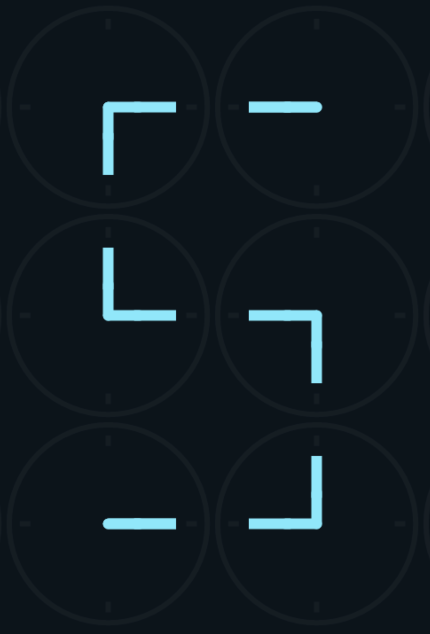
    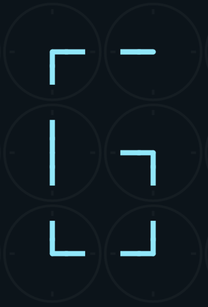
    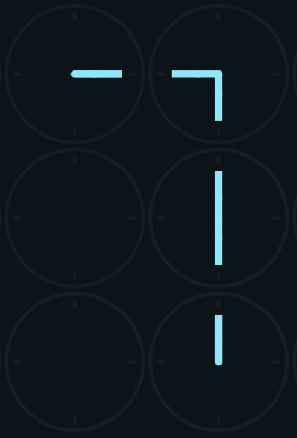
    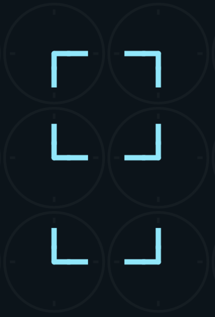
    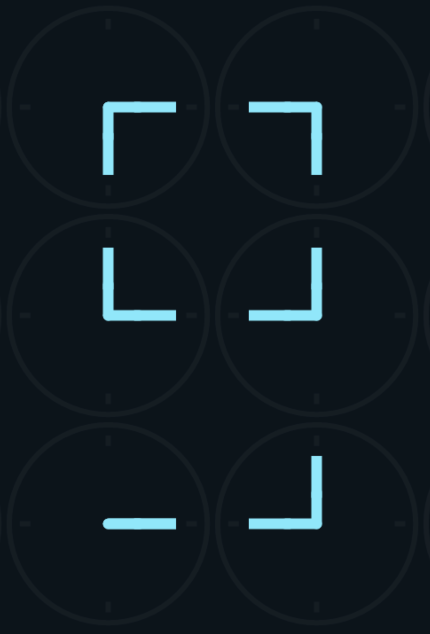

### Animation
At least one digit changes every minute. The analog clock hands
simultaneously rotates clockwise to reach their new position and display a new digit.
The unused hands will also fade out to improve the readability of the overall digit.

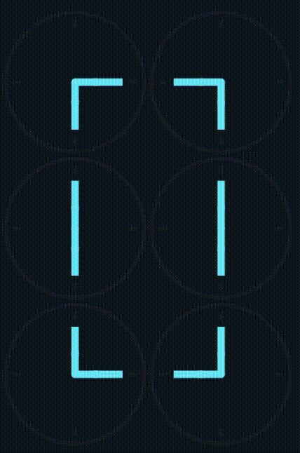

### Details
A particular attention was given to the following details:
* **Clock hand ends**: the clock hands are rounded on one end only. It ensures continuity of straight
the segments and gives *smooth* corners and terminations to the digits.

* **Readability**: a different color is used for the hour digits and for the minutes digits.
The colors create a clear separation between the two group of digits and makes the reading easier.

### Theme
A light theme is also available:

    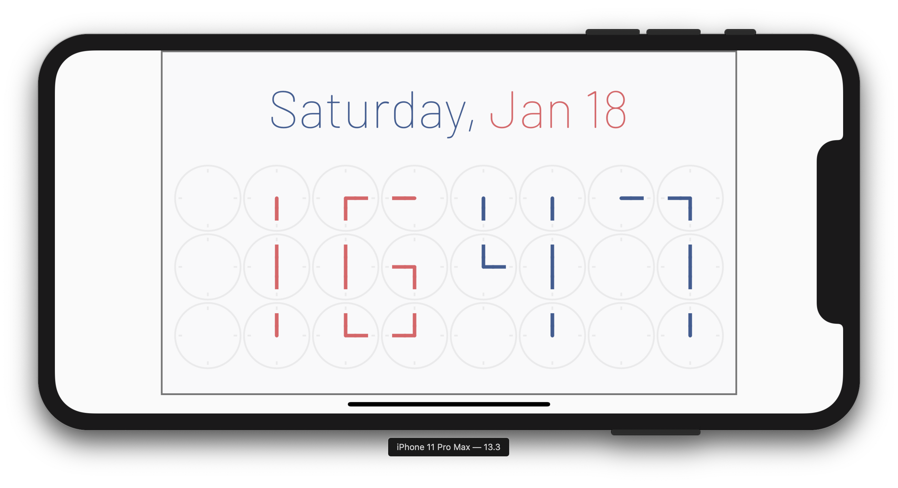

## Intl
The current date can be displayed in multiple languages thanks to
the [intl](https://pub.dev/packages/intl) package. Both 12-hour and 24-hour formats are supported.

    
    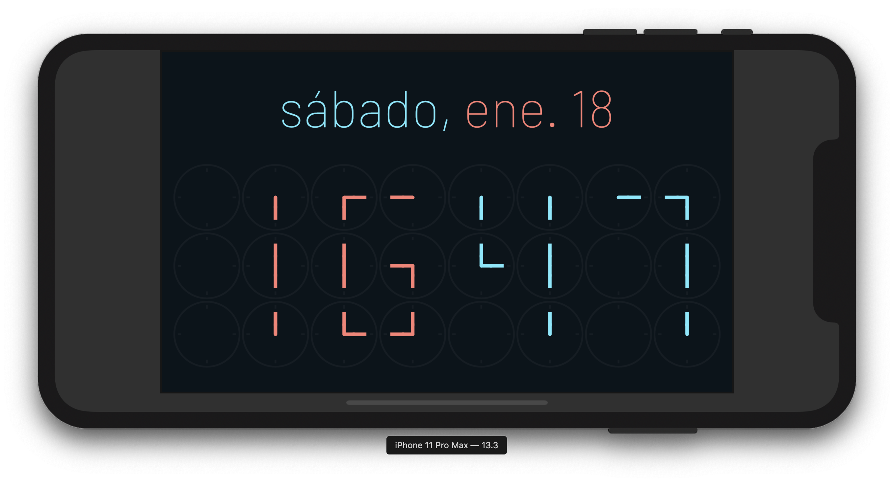

## Credits
* [ClockClock 24](https://clockclock.com/) for the inspiration
* [Barlow](https://fonts.google.com/specimen/Barlow) for the font
* The Flutter team for the awesome framework
